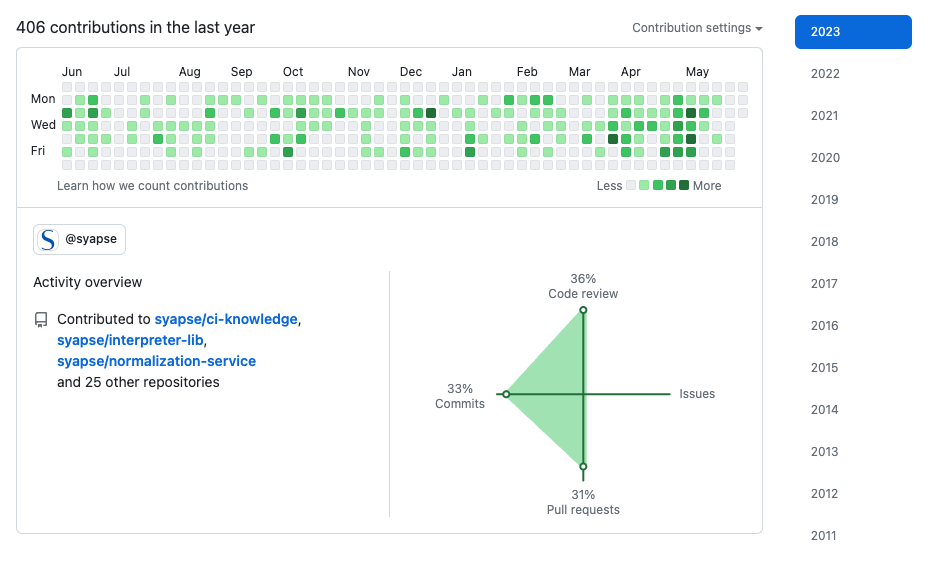

# Employment History

## Syapse &nbsp;&nbsp;&nbsp;&nbsp; May 2018 - June 2023

### Engineering Manager / Principal Engineer

#### Knowledge management team

Created and managed the knowledge management group that radically improved data quality and created a fully integrated closed loop curated and measurable normalized data pipelines supervised by clinical informaticists and subject matter experts. A hands on member of the team, created and maintained many of the core code and technologies that power the assets of this group.

Developed and maintained a full end to end curated knowledge management system for medical terminologies and inference based on industry standards combined with in-house expert input (clinical informatics, oncologists, variant scientists, clinicians, pharmacists, ontologists, etc.) Applied knowledge models to raw patient medical data.

Some of the challenges tackled:

Clinical, genomic testing, cancer registry, and medication **data normalization**: raw data comes in from multiple health systems, in-house and outside labs (clinical and sequencing labs), cancer registries, Syapse manual abstractors. The raw data does not conform to uniform standards, comes in many formats, suffers from missingness, and variations in coding. The data is not fit for aggregation and analytics, and has high volume.

* Brought multiple critical data domains to **95%-99% normalization rates** (examples: biomarkers, genes, diagnosis codes, histology, morphology, topography, medications, staging, and more)
* Increased **data processing throughput by 5x** - All of Syapse data can be **refreshed in a few hours** for millions of patients from tens of sources
* This is at the foundation of enabling retrospective studies, studies related to clinical trials, finding patients for clinical trials, exploring patient populations, creating patient cohorts, etc.

**Knowledge management:** Cancer is a complex domain, and each cancer has its peculiar aspects. No single expert knows everything. Managing, coordinating, reviewing, and verifying knowledge in a highly inter-disciplinary environment is challenging.

* Built an RDF ontology based knowledge management system serving the clinical informatics group, subject matter experts, and others.
* Automated the processing and updates of industry standard terminologies, integrated with Syapse specific annotations, additions, overrides, synonyms etc. Also adaptations to the cancer domain when the standard terminologies were insufficiently expressive for cancer.
* Automated ontology validation
* **Automated an integrated multi-ontology knowledge release process**, complete with test automation, integration with the data processing and normalization system, traceability etc.
* Automated the detection and capture of error, values that failed to normalize - with self service tooling for informaticists to report, manage and prioritize work on ontology maintenance. **This system was critical for achieving and maintaining high normalization rates in a constantly changing data landscape**. This results in **a continuous improvement process for data curation**.
* Built **APIs to serve knowledge** and normalization services to other systems

**Complex inference:** even when you can normalize basic data much remains either missing or too complex to normalize by simple means.

* We built a solution to **automatically infer negative results** when sequencing labs report only positive results
* We successfully built a unique variant normalization system for sequence variants and amino acid changes that takes multiple inputs from lab results and can tolerate not only variations in coding of MRNA variants or protein coding but also missing data in many cases (e.g. cases where a transcript ID is not provided). this **brought variant normalization upwards of 84% rate from near zero**.
* Combined variant information with other real world clinical data and with sources like OncoKB to **produce deep analytic capabilities** that includes level of evidence and efficacy **in real world patients**.

**Mortality data:** for survival studies, Kaplan-Meier curves, and other critical studies in treatments and pharmaceuticals accurate survival and date of death data is critical. But outside of controlled studies, in real world patients - reliable data is hard to come by.

* Developed a highly accurate, yet HIPPA compliant **solution for highly accurate date of death determination** by using multiple sources of variable reliability, including hospitals and obituary data
* As part and parcel of this, also developed a sophisticated and innovative and automated **entity resolution framework for reconciling patient identity** across multiple data sources with inconsistent identification with capabilities **exceeding what can be found in commercially available EMPI systems**

The team and I also developed a highly scaleable and cost effective data processing, normalization, and projection system for creating flexible and adaptive end to end analytical pipelines from raw data through normalization and inference, through analytics through final product.

Key technologies in use: 

* general: Python, AWS, RDS, Postgresql, sqlite, Duckdb, S3, Docker, Kubernetes, Athena
* knowledge system: Allegrograph, RDF, SPARQL, Protege, SQL, pydantic, FastAPI, Redis, HTML, Jinja2, HTMX, Bootstrap, Docker, Kubernetes
* data processing system: airflow, Spark, Python multiprocessing, pyarrow, Parquet, Docker, Kubernetes

Key health care standards and practices

* UMLS, RxNorm, NDC, OncoKB, Oncotree, NAACCR, SEER, ICD-10-CM, ICD-9-CM, ICD-O-3, ,HL7, FHIR, OMOP

------

## Udemy &nbsp;&nbsp;&nbsp;&nbsp; May 2017 - 2018

### Principal Engineer

- Back end and front-end development for the Udemy discount engine for the largest online video course marketplace,and a very high growth environment
- Worked on a pricing engine for dynamic offer price determination
- Improved system reliability and performance, simplified and refactored existing designs
- Drove initiatives to simplify and streamline internal user experience, which led to new direction byproduct
- Highly agile development process, CI/CD
- Stack: **Python, Django, Mysql**, REST, Redshift, S3, **Celery, Redis**, RabbitMQ, JS, ReactJS, React-Bootstrap, Mobx, data pipelines, Datadog, git 

------

## Visa Inc. &nbsp;&nbsp;&nbsp;&nbsp; 2013 - 2017

### Chief Architect

* Designed near real-time transaction notifications and history services for Android Pay, Samsung Pay, Apple Pay, and others resulting in successful and timely delivery under tight timelines.
* Integrated systems with Visa processing, other Visa systems, and large external partners like Google, Apple, Samsung, Microsoft, and the largest banks in a security-hardened environment.
* Increased scale and improved reliability, performance, availability, and resilience of critical platform components while introducing several technologies and practices to the organization.
* Effectively worked with teams in 6 global locations and 10+ departments.
* Enterprise Architecture
* Stack: **Java, Spring, Oracle**, Mysql, Kafka, Cassandra, MQ, ZMQ, **JAXB, REST**, Jersey, ElasticSearch, git

----

## Previously

A long history in startups in the Silicone Valley in engineering positions ranging from IC, to director, to VP of engineering, to owner and operator. Two major exists. Span of control from 4 to 80 people.

[Older Employment History](older-history.md)